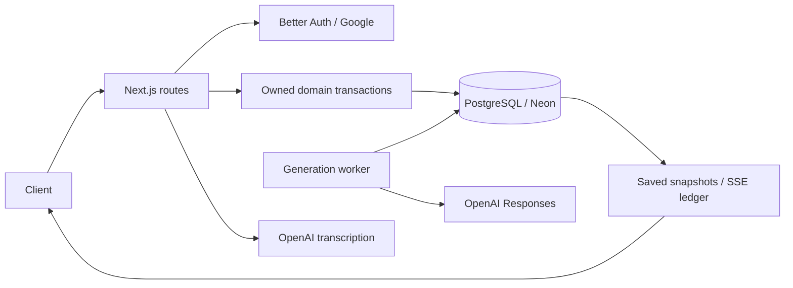
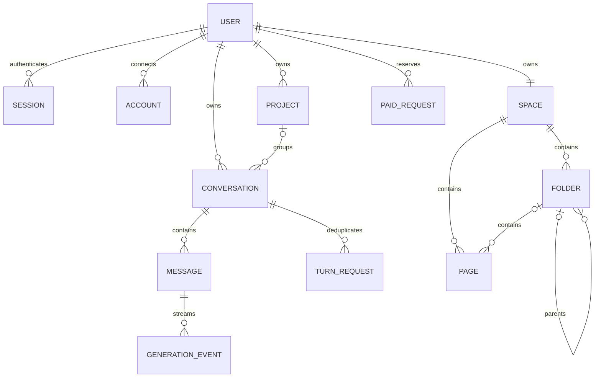

# Architecture and schema

Next.js Node route handlers validate the database-backed Better Auth session, derive ownership and
call domain functions. Mutation requests also validate the exact configured Origin. Drizzle supplies
one shared schema and transactional PostgreSQL or explicit Neon drivers. A separate long-running
worker executes native background OpenAI Responses and persists progress; HTTP clients consume saved
state and replayable SSE rather than owning inference lifetimes.

## Data relationships

The canonical definitions are in [`lib/db/schema.ts`](../lib/db/schema.ts), with reviewed SQL in
`drizzle/`. Auth records use string IDs; domain records use UUIDs. `verification` stores Better Auth
verification values. `generation_job` deliberately has no foreign key: its content-free provider
cleanup records survive conversation deletion. It is identified by generation UUID and contains only
provider ID, job state, cleanup flag, lease and timestamps.

Projects group conversations without contributing prompt context. Deleting a project detaches
conversations; deleting a conversation removes messages, event ledgers and request fingerprints and
queues known remote Responses for cleanup. A user owns one private space. Composite foreign keys
prevent foreign project associations and cross-space folder/page links; deleting a folder cascades
through its subtree. Markdown pages are stored as complete text and never enter assistant context.

## Transaction boundaries

Conversation mutations lock the owned conversation row, reserve turns and generation
identity/version, and update messages/context atomically. A partial unique index permits one active
assistant per conversation. Every later worker write verifies that same current identity/version
under the lock; obsolete callbacks cannot recreate edited or deleted history. Provider network work
runs outside database transactions. Only completed output advances valid context; failed partial
text remains display history.

The worker claims database jobs with short leases and `SKIP LOCKED`, saves provider IDs before
closing the initial upstream stream, then polls/resumes after the saved provider sequence. The
application SSE event cursor is independent. An expired creation claim without a provider ID fails
as ambiguous rather than automatically spending again. Latest-turn replacement restores its pre-turn
context and discards its old assistant/events; opaque reasoning/compaction artifacts remain private.
See [execution](conversations.md) for recovery and retention limits.

Space mutations serialize on the owner's space row; ancestor checks and cascades therefore handle
concurrent moves/deletion. Pages use the returned `updatedAt` as a mandatory PATCH precondition to
prevent lost updates. Shared paid-request reservations enforce short SQL-backed rate/concurrency
bounds across generation and transcription. These intentionally simple database controls suit a
small installation; they are not financial guarantees.

Secrets are read lazily in server-only modules. Public projections omit provider identifiers, replay
artifacts and raw errors. Recording transcription stores no audio/transcript and creates no message.
[Database](database.md), [private pages](spaces.md) and [transcription](transcription.md) document
the exact persistence and validation contracts.
